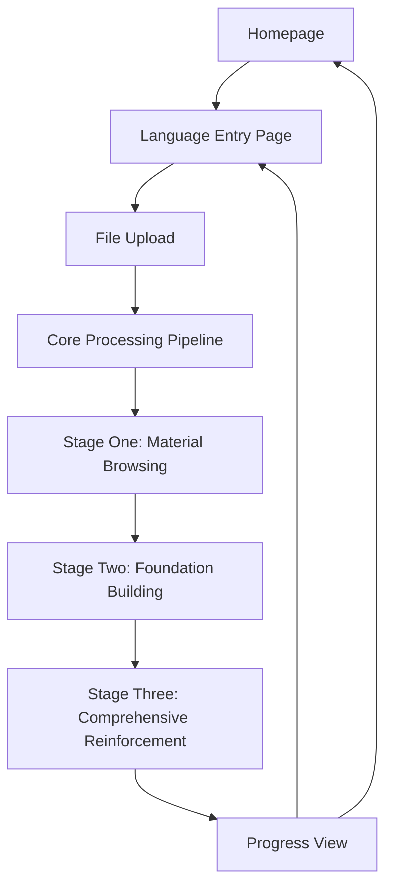

## 1. Product Overview
Lesslingo (少邻国)是一个纯本地、基于AI Agent的外语学习系统，所有学习内容由AI实时生成，无需预构建语言数据库。
- 解决用户无需注册、无需云服务即可开始学习的需求，目标用户为希望便捷学习外语的学习者
- 市场价值在于提供完全本地化、多模态输入、自由选择语言的学习体验

## 2. Core Features

### 2.1 User Roles
| Role | Registration Method | Core Permissions |
|------|---------------------|------------------|
| User | No registration required | Access all learning features |

### 2.2 Feature Module
1. **Homepage**: language family display, learned languages, upcoming languages
2. **Language Entry Page**: language pair selection, file upload, learning history
3. **Quiz Interface**: exercise display, navigation, progress tracking
4. **Learning Stages**: material browsing, foundation building, comprehensive reinforcement

### 2.3 Page Details
| Page Name | Module Name | Feature description |
|-----------|-------------|---------------------|
| Homepage | Language Family Visualization | Interactive visualization of language relationships using React Flow or D3.js |
| Homepage | Learned Languages | List of languages the user has started learning |
| Homepage | Upcoming Languages | Suggested or planned languages |
| Language Entry Page | Language Selector | Users select source and target languages |
| Language Entry Page | Upload Component | Drag-and-drop or click-to-browse file upload for text, audio, and image files |
| Language Entry Page | File List | Auto-generated titles, progress bars showing processing and learning status |
| Quiz Interface | Question Body | Main content area displaying the current exercise |
| Quiz Interface | Toggle Switches | Enable/disable exercise types (Listen/Speak) |
| Quiz Interface | Word List Shortcut | Quick access to the vocabulary list during exercises |
| Quiz Interface | Navigation | Previous and next buttons, progress view |
| Learning Stages | Stage One (Material Browsing) | Read-only mode with word list, pronunciation rules, grammar notes |
| Learning Stages | Stage Two (Foundation Building) | Modular linear progression with word recognition, matching exercises, sentence assembly |
| Learning Stages | Stage Three (Comprehensive Reinforcement) | Random pool of exercises including Read 3 (Cloze), Listen, Speak, Write |

## 3. Core Process
1. User opens the application and lands on the homepage
2. User selects a language pair on the language entry page
3. User uploads a file (text, audio, or image) for processing
4. System processes the file through the core pipeline: input parsing, text processing, vocabulary extraction, TTS generation
5. User starts learning in Stage One (Material Browsing) to review materials
6. User progresses to Stage Two (Foundation Building) for structured learning
7. User moves to Stage Three (Comprehensive Reinforcement) for randomized exercises
8. User can navigate back to previous stages or the homepage at any time

## 4. User Interface Design
### 4.1 Design Style
- Primary colors: #4CAF50 (green), #2196F3 (blue)
- Secondary colors: #FFC107 (yellow), #FF5722 (orange)
- Button style: Rounded corners, 3D effect on hover
- Font: Google Fonts - Poppins (display), Roboto (body)
- Layout style: Card-based with clean spacing, Duolingo-inspired cute and relaxed design
- Icon style: Lucide React icons with playful animations

### 4.2 Page Design Overview
| Page Name | Module Name | UI Elements |
|-----------|-------------|-------------|
| Homepage | Language Family Visualization | Interactive nodes and edges, zoom and drag functionality, color-coded language families |
| Language Entry Page | Upload Component | Drop zone with dashed border, file type icons, progress indicators |
| Language Entry Page | Language Selector | Dropdown menus with flag icons, smooth transitions |
| Quiz Interface | Question Body | Clean card design, clear typography, interactive elements |
| Quiz Interface | Progress View | Duolingo-like module tree, visual completion indicators, clickable modules |
| Learning Stages | Stage One | Scrollable word list, collapsible sections, pronunciation audio players |
| Learning Stages | Stage Two | Multiple-choice options, matching game interface, sentence assembly drag-and-drop |
| Learning Stages | Stage Three | Cloze exercise interface, audio players, speech input indicators |

### 4.3 Responsiveness
- Desktop-first design with mobile adaptation
- Touch optimization for mobile devices
- Responsive layout that adjusts to different screen sizes
- Collapsible navigation for mobile view

### 4.4 3D Scene Guidance
Not applicable for this project.