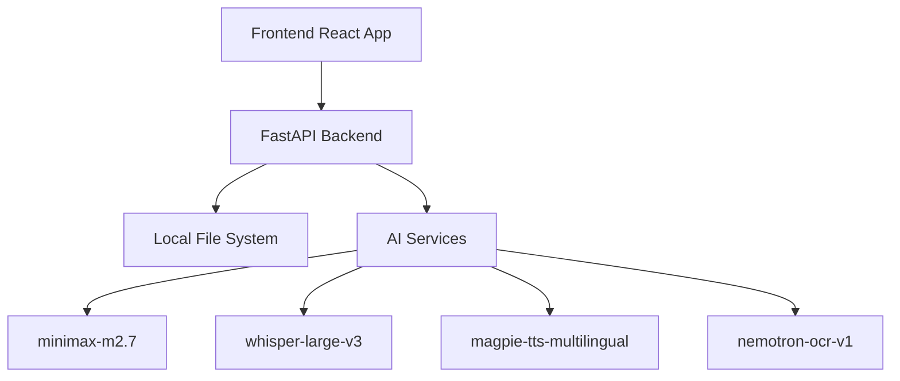
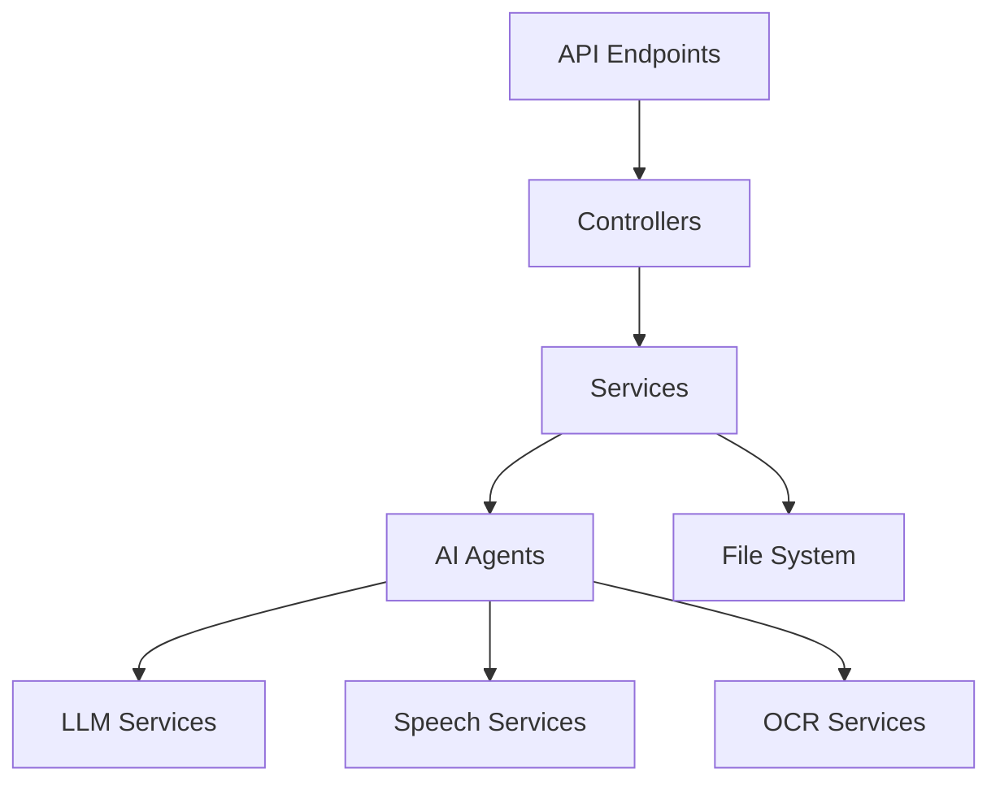

## 1. Architecture Design


## 2. Technology Description
- Frontend: React@18 + TypeScript + TailwindCSS + Vite
- Backend: Python FastAPI + BackgroundTasks
- Storage: Local File System (JSON + audio files + image files)
- AI Services: All accessed locally
- Initialization Tool: vite-init

## 3. Route Definitions
| Route | Purpose |
|-------|---------|
| / | Homepage with language family visualization |
| /language/:langPair | Language entry page with file management |
| /learn/:fileId/stage/:stage | Learning interface for specific file and stage |
| /progress/:fileId | Progress view for specific file |

## 4. API Definitions

### 4.1 File Upload
- **Endpoint**: POST /api/upload
- **Request**: Multipart form data with file
- **Response**: { file_id: string, status: string }

### 4.2 Pipeline Status
- **Endpoint**: GET /api/pipeline/{file_id}/status
- **Response**: { status: string, progress: number, data?: object }

### 4.3 Next Exercise
- **Endpoint**: POST /api/learn/{file_id}/stage/{stage}/next
- **Request**: { current_progress?: object }
- **Response**: { exercise: object, progress: object }

### 4.4 Word Detail
- **Endpoint**: GET /api/agent/word_detail/{word_id}
- **Response**: { word: string, ipa: string, context_meaning: string, variants: string[], difficulty: number, source_sentence_ids: number[] }

### 4.5 Generate Distractors
- **Endpoint**: POST /api/agent/generate_distractors
- **Request**: { word: string, correct_answer: string, count: number }
- **Response**: { distractors: string[] }

### 4.6 Generate Examples
- **Endpoint**: POST /api/agent/generate_examples
- **Request**: { word: string, count: number }
- **Response**: { examples: string[] }

### 4.7 Generate Cloze
- **Endpoint**: POST /api/agent/generate_cloze
- **Request**: { sentence: string }
- **Response**: { cloze: object }

### 4.8 Generate Pronunciation Notes
- **Endpoint**: POST /api/agent/generate_pronunciation_notes
- **Request**: { language: string }
- **Response**: { notes: string }

### 4.9 Speech Evaluation
- **Endpoint**: POST /api/speech/evaluate
- **Request**: Multipart form data with audio file
- **Response**: { score: number, feedback: string }

## 5. Server Architecture Diagram


## 6. Data Model

### 6.1 Data Model Definition
```mermaid
erDiagram
    FILE -- has --> VOCAB
    FILE -- has --> SENTENCES
    FILE -- has --> PROGRESS
    VOCAB -- appears_in --> SENTENCES
    PROGRESS -- tracks --> VOCAB
    PROGRESS -- tracks --> SENTENCES
```

### 6.2 Directory Structure
```
/workspace/data
├── /languages/
│   └── /zh/
│       ├── intro.json
│       └── /assets/
└── /files/
    └── <filename,zh-en>/
        ├── source.ext
        ├── cleaned_text.txt
        ├── pipeline_data.json
        ├── vocab.json
        ├── /tts/
        └── /progress/
            ├── snapshot.json
            ├── state.json
            └── mistakes.json
```

### 6.3 Data Definitions

#### vocab.json
```json
{
  "word": "example",
  "ipa": "/ɪɡˈzæmpəl/",
  "context_meaning": "an instance or illustration",
  "variants": ["examples", "exemplary"],
  "difficulty": 1,
  "source_sentence_ids": [0, 3, 7]
}
```

#### pipeline_data.json
```json
{
  "sentences": [
    {
      "id": 0,
      "original": "This is an example.",
      "translation": "这是一个例子。",
      "words": ["this", "is", "an", "example"],
      "pronunciation_notes": "...",
      "grammar_notes": "..."
    }
  ],
  "pronunciation_notes": "...",
  "grammar_notes": "..."
}
```

#### snapshot.json
```json
{
  "snapshot_id": "uuid",
  "created_at": "2026-04-16T10:00:00Z",
  "vocab_snapshot": [...],
  "sentence_snapshot": [...],
  "question_hash": "sha256..."
}
```